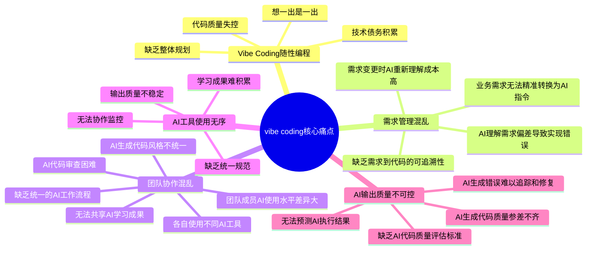
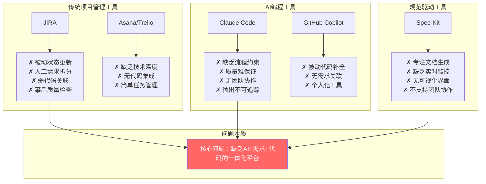
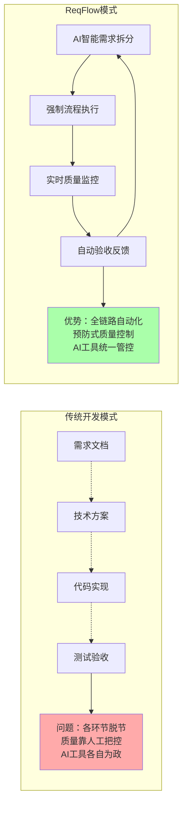

# 01-需求明确

## 1、项目名称

ReqFlow - AI驱动的规范化开发管理平台

## 2、产品定位

### 2.1 产品概述
ReqFlow是一个**类似JIRA的项目管理软件**，集成AI大模型能力，专门解决"vibe coding"过程不规范的问题。基于规范驱动开发思想，通过AI智能拆分需求、强制规范开发流程、实时质量监控，确保从需求到代码的全链路规范化，最大程度减少开发错误和质量问题。

> **核心理念**：需求即代码，文档即软件，业务即实现

### 2.2 痛点分析图



### 2.3 现有方案局限性对比



### 2.4 ReqFlow创新解决方案



### 2.5 核心价值
- **解耦合设计**: 通过Epic/Story/Task三层解耦，避免AI编程混乱
- **技术栈分离**: 数据库/后端/前端可独立并行开发  
- **接口契约约束**: 双层接口定义，强制模块间规范交互
- **AI智能拆分**: 将模糊需求拆解为可执行的结构化任务
- **并行开发支持**: 不同Epic、不同Task可自由安排开发顺序

## 3、核心功能模块

### 功能1：登录账号

用户输入账号密码，即可登录。

测试账号，请帮我默认提前设置:账号为：15173737427，默认密码为12345678。

登录账号后，进入系统首页。

### 功能2：系统首页

  核心布局

  顶部：用户信息 + 快捷操作
  主体：项目看板视图
  侧边：快速统计

  具体内容

  主要区域 - 我的项目看板：
  - 以卡片形式展示用户的所有项目
  - 每个项目卡片显示：
    - 项目名称
    - 项目简介（一句话描述）
    - 当前阶段标签（需求澄清中/技术选型中/需求拆分中/开发中/已完成）
    - 项目进度条
    - 最后更新时间
  - 卡片右上角快捷操作按钮：继续完善/查看详情/导出文档

  顶部快捷区域：
  - "创建新项目"按钮（主要CTA）
  - 搜索框（搜索项目）
  - 用户头像和设置

  侧边统计区域（可选）：
  - 项目总数
  - 进行中项目数
  - 本周新建项目数
  - 待处理任务数

  空状态设计：
  - 当用户没有项目时，显示引导创建第一个项目的界面

  交互逻辑

  - 点击项目卡片 → 进入项目详情/当前阶段页面
  - 根据项目当前阶段，智能跳转到对应功能
    - 刚创建 → 需求澄清页面
    - 澄清完成 → 技术选型页面
    - 选型完成 → 需求拆分页面

### 功能3：创建项目

#### **步骤1：一句话介绍你的项目**

用户输入一句话介绍自己的项目。

#### 步骤2：项目取名

有两种命名方式可以选择：

- 手动取名
- Vibe一下
  - 调用Qwen模型，帮用户生成三个名字，分别说明理由
  - 用户可以从三个名字中选择一个
  - 如果用户感觉不满意，可以点击"换一批"，AI需要重新生成三个名字

用户点击创建，则项目创建成功。

此时，需引导用户进行需求澄清，用户可以选择是否立刻进行需求澄清，点击“立刻出发”，则进入需求澄清页面。点击“等会再说”，则返回系统首页。等用户需要时，在项目看板点击项目，可以再进行需求澄清。

#### 步骤3：项目需求澄清

需求澄清页面，引导用户进行需求澄清。

调用Qwen模型，基于用户对自己一句话，使用多轮对话方式，提出问题，帮助用户澄清需求。

- AI每次只提出一个问题
- 显示给用户的问题和回复，必须是用户友好的文本格式，而不是json串
- 多轮对话，在下面两种情况结束 
  - 用户点击按钮:“结束澄清”
  - AI判断需求已经明确了，判断需要有合理的标准
- 需求澄清需要有一定逻辑与策略，遵循深度遍历原则，同时，需要关注项目预期的用户人数等信息，以方便后续的技术选型
- 在需求澄清结束前，AI需要基于对话的历史，总结理解的需求，让用户审核ai理解的需求
  - 如果用户点击“没问题”，则需求澄清结束
  - 如果用户点击"你错了"，则需要问用户”主人，我哪里理解不对？“
    - 用户填写反馈后，ai根据用户反馈，调整需求理解(注意不要完全重新生成，而是基于用户的反馈针对性修改)
    - 调整后的需求，重新由用户进行确认。
  - 以上步骤，退出条件，就是用户点击”没问题“，否则要重复用户反馈，ai调整的步骤。

需求澄清后，需在项目详情中保存最后总结的需求。

需引导用户进行需求技术选型，用户可以选择是否立刻进行技术选型，点击“立刻出发”，则进入需求澄清页面。点击“等会再说”，则返回系统首页。等用户需要时，在项目看板点击项目，可以再进行技术选型。

### 功能4：技术选型

业务需求澄清后进行，项目可以进行技术选型。

技术选型有两个选项：

- 朕说了算
  - 用户输入自己的技术选型方案
  - AI给出优化建议
  - 用户可以选择基于AI的建议编辑自己的选型方案
- Vibe一下
  - AI基于项目的名字、简介、需求等，生成技术选型方案，并给出理由
  - 用户可以根据ai的技术选型方案手动修改

技术选型方案，为了尽量减少开发的难度考虑，AI在设计时，优先采用以下原则为用户进行技术选型或者提出建议:

- 前后端分离
- 需要使用swagger-ui
- 前端需要包含UI 组件库(如 Element Plus、Ant Design)

**技术选型文档格式规范**：
- 必须以表格形式显示：| 分类 | 技术选择 | 选择理由 |
- 只包含关键信息：技术选择 + 简要理由
- 文档控制在30行以内，便于快速阅读和决策
- 用户可以在表格中直接编辑修改技术选择
- 体现"够用就好"的设计理念，避免过度设计

用户点击"完成选型"，完成技术选型。需在项目技术选型字段中保存最后的技术选型方案。

需引导用户进行架构设计，用户可以选择是否立刻进行架构设计，点击“立刻出发”，则进入需求澄清页面。点击“等会再说”，则返回系统首页。等用户需要时，在项目看板点击项目，可以再进行技术选型。


### 功能5：需求拆分

基于spec driven的思想，根据业务需求，引导用户进行需求拆分，每个拆分出来的需求，对应一个系统的ticket(类似于jira)。

#### (1) 两层拆分架构

**Epic（史诗级）**：
- **层级**：最高层，业务服务边界层面
- **内容**：完整的业务能力或产品功能模块
- **例子**："用户认证系统"、"订单管理系统"
- **特点**：跨越多个Sprint，定义服务边界和依赖关系
- **必须包含**：服务契约定义、对外接口声明、依赖关系映射

**Story（用户故事）**：
- **层级**：具体功能实现层面
- **内容**：从用户角度描述的具体功能需求，直接可开发执行
- **例子**："作为用户，我希望能够通过邮箱和密码登录"
- **特点**：包含完整的技术实现细节，数据库设计、后端接口、前端界面
- **必须包含**：API接口定义、数据库设计、前端组件规格、验收标准

#### (2) 双层接口契约机制

**Epic层服务契约**：
```yaml
service_name: user-auth-service
service_boundary: "用户认证、权限管理、会话控制"
dependencies: []  # 依赖的其他Epic服务
capabilities:
  - endpoint_prefix: "/api/auth/*"
    description: "认证相关接口"
  - endpoint_prefix: "/api/users/*" 
    description: "用户管理接口"
domain_models:
  - User: [id, email, role, status]
  - Session: [token, user_id, expires_at]
integration_contracts:
  - "其他服务获取用户信息必须调用 GET /api/users/{id}"
  - "权限验证必须调用 POST /api/auth/verify"
  - "禁止直接访问users、sessions数据表"
```

**Story层完整规格标准**：

每个Story必须包含以下五个部分的完整规格：

1. **后端API接口定义** - 后端开发依据，定义REST API规范
2. **数据库设计** - 数据库开发依据  
3. **前端UI规格** - 前端开发依据，包括组件接口、路由、状态管理
4. **验收标准** - 功能完成的明确标准，测试和验收依据
5. **Mock数据契约** - 并行开发支持

其中前端UI规格必须包含：
- **组件接口定义**：props、events、methods等对外接口
- **路由配置**：页面路径、路由参数、导航守卫
- **状态管理**：全局状态、本地状态的定义和流转
- **布局描述**：页面整体布局和组件排列方式
- **字段规格**：每个输入字段的类型、验证、占位符
- **按钮规格**：按钮文案、样式、位置、宽度
- **状态定义**：loading、error、success等状态的具体表现
- **交互行为**：点击、输入、跳转的具体逻辑
- **响应式设计**：移动端和PC端的适配方案
- **线框图**：ASCII字符绘制的页面结构图
- **设计风格**：参考的设计系统或UI库风格

其中验收标准必须包含：
- **功能验收**：从用户角度描述功能是否正常工作
- **界面验收**：UI界面是否符合设计要求
- **性能验收**：响应时间、加载速度等性能指标
- **兼容性验收**：不同设备、浏览器的兼容性要求
- **异常处理验收**：错误情况下的系统表现
- **安全验收**：数据安全、权限控制等安全要求

**Story层接口规格示例**：
```yaml
story_id: "AUTH-001"
story_title: "用户邮箱密码登录"

# 后端API接口定义
backend_api:
  endpoint: "POST /api/auth/login"
  request_schema:
    email: {type: string, format: email, required: true}
    password: {type: string, minLength: 8, required: true}
    remember_me: {type: boolean, default: false}
  response_schema:
    success_200:
      access_token: string
      refresh_token: string
      user: {id: string, email: string, role: string}
    error_401:
      message: "邮箱或密码错误"
  business_rules:
    - "密码错误5次锁定账户30分钟"
    - "remember_me=true时refresh_token有效期30天"
    - "登录成功更新last_login_at字段"

# 数据库设计
database_design:
  tables:
    - name: users
      fields: [id(UUID), email(VARCHAR), password_hash(VARCHAR), status(ENUM), last_login_at(TIMESTAMP)]
      indexes: [email(UNIQUE), status]
    - name: login_attempts  
      fields: [id(UUID), email(VARCHAR), attempts_count(INT), locked_until(TIMESTAMP)]
      indexes: [email, locked_until]

# 前端UI规格
frontend_specification:
  # 组件接口定义
  components:
    - component: LoginForm
      props: 
        - onSubmit: {type: "function", description: "登录提交回调"}
        - loading: {type: "boolean", default: false, description: "加载状态"}
        - error: {type: "string", default: null, description: "错误信息"}
      events:
        - submit: {params: "{email, password, remember}", description: "提交登录表单"}
        - register: {params: "void", description: "点击注册链接"}
      methods:
        - validateForm: {return: "boolean", description: "验证表单有效性"}
        - resetForm: {return: "void", description: "重置表单"}
        
    # UI规格定义  
    - component: LoginForm
      layout: "居中卡片布局，最大宽度400px，圆角边框，阴影效果"
      fields:
        - email: {type: "input", placeholder: "请输入邮箱", validation: "实时邮箱格式检查"}
        - password: {type: "password", placeholder: "请输入密码", showToggle: true}
        - remember: {type: "checkbox", label: "记住密码", default: false}
      buttons:
        - login: {text: "登录", type: "primary", position: "center", width: "100%"}
        - register: {text: "还没有账号？立即注册", type: "link", position: "bottom"}
      states:
        - loading: "按钮显示spinner，禁用所有输入"
        - error: "表单顶部显示红色错误提示框"
      responsive: "移动端单列布局，PC端保持居中"
      wireframe: |
        ┌─────────────────────────┐
        │        ReqFlow         │
        │       用户登录          │
        ├─────────────────────────┤
        │  ┌─────────────────┐   │
        │  │   邮箱输入框     │   │
        │  ├─────────────────┤   │  
        │  │   密码输入框  👁  │   │
        │  ├─────────────────┤   │
        │  │ ☐ 记住密码      │   │
        │  ├─────────────────┤   │
        │  │   [登录按钮]     │   │
        │  └─────────────────┘   │
        ├─────────────────────────┤
        │    还没有账号？立即注册   │
        └─────────────────────────┘
        
  # 路由配置
  routes:
    - path: "/login"
      component: LoginPage
      meta: {title: "用户登录", requiresGuest: true}
      beforeEnter: "检查用户是否已登录，已登录则跳转首页"
      
  # 状态管理
  state_management:
    - store: authStore
      state:
        - user: {type: "object", default: null}
        - isLoggedIn: {type: "boolean", default: false}
        - loginLoading: {type: "boolean", default: false}
      actions:
        - login: {params: "{email, password}", description: "执行登录"}
        - logout: {params: "void", description: "执行登出"}
      mutations:
        - SET_USER: "设置用户信息"
        - SET_LOGIN_LOADING: "设置登录加载状态"

# 验收标准
acceptance_criteria:
  # 功能验收
  functional:
    - "用户输入正确的邮箱和密码，点击登录按钮，能够成功登录系统"
    - "用户输入错误的邮箱或密码，显示'邮箱或密码错误'提示信息"
    - "用户连续5次输入错误密码，账户被锁定30分钟，显示锁定提示"
    - "用户勾选'记住密码'，下次访问时自动填充登录信息"
    - "登录成功后自动跳转到系统首页"
    
  # 界面验收  
  ui:
    - "登录表单居中显示，最大宽度400px，具有圆角边框和阴影效果"
    - "邮箱输入框实时验证邮箱格式，格式错误时显示红色边框"
    - "密码输入框右侧有眼睛图标，点击可切换明文/密文显示"
    - "登录按钮为主色调，宽度100%，加载时显示spinner动画"
    - "错误提示在表单顶部显示，红色背景，白色文字"
    
  # 性能验收
  performance:
    - "登录接口响应时间不超过2秒"
    - "页面首次加载时间不超过3秒"
    - "表单验证反馈延迟不超过500ms"
    
  # 兼容性验收
  compatibility:
    - "支持Chrome、Firefox、Safari、Edge最新版本"
    - "移动端适配iPhone、Android主流设备"
    - "支持1920x1080、1366x768、375x667分辨率"
    
  # 异常处理验收
  error_handling:
    - "网络异常时显示'网络连接失败，请稍后重试'"
    - "服务器错误时显示'系统繁忙，请稍后重试'"
    - "接口超时时显示超时提示并允许重试"
    
  # 安全验收
  security:
    - "密码在传输和存储时必须加密"
    - "登录失败不泄露用户是否存在的信息"
    - "JWT token设置合理的过期时间"
    - "防止暴力破解攻击（频率限制）"
```

#### (3) AI智能拆分流程

**步骤1：Epic层拆分**
- AI基于业务需求识别独立的业务领域
- 自动生成服务边界和依赖关系图
- 为每个Epic生成服务契约模板
- 用户确认：通过/拒绝/修改建议

**步骤2：Story层拆分**
- AI基于每个Epic拆分具体的用户功能
- 自动生成完整的Story规格：后端API接口+数据库设计+前端UI规格+验收标准+Mock契约
- AI生成详细的前端UI规格，包括：
  - 组件接口定义（props、events、methods）
  - 路由配置（路径、守卫、元信息）
  - 状态管理（store、state、actions）
  - UI布局设计（字段、按钮、状态、交互、线框图）
- AI生成完整的验收标准，包括：
  - 功能验收（用户角度的功能测试点）
  - 界面验收（UI设计实现标准）
  - 性能验收（响应时间、加载速度指标）
  - 兼容性验收（设备、浏览器支持）
  - 异常处理验收（错误场景处理）
  - 安全验收（数据安全、权限控制）
- AI基于项目技术选型生成对应的UI库风格（如Element Plus、Ant Design）
- 确保Story间后端接口契约、前端接口规范、UI风格、验收标准的一致性
- 用户确认：通过/拒绝/修改建议

#### (4) 并行开发约束机制

**接口契约先行**：
- Epic间依赖关系确定后，各Epic可并行开发
- Story的完整规格确定后，前后端可并行开发
- 前端基于API契约和数据库设计使用标准化Mock数据

**Mock数据标准**：
```javascript
// 自动生成的Mock数据契约
const mockContracts = {
  "POST /api/auth/login": {
    success_response: {
      access_token: "mock_jwt_token_xxxxx",
      refresh_token: "mock_refresh_token_xxxxx", 
      user: {id: "uuid-1234", email: "test@example.com", role: "user"}
    },
    error_responses: {
      401: {message: "邮箱或密码错误"},
      429: {message: "请求过于频繁，请稍后再试"}
    }
  }
}
```

**集成验证机制**：
- Story拆分完成后：API接口、数据库设计、前端组件三者一致性验证
- 开发完成后：Mock数据替换为真实API验证
- Epic完成后：端到端集成测试验证

**拆分质量控制**：
- 每个Epic必须包含完整的服务契约
- 每个Story必须包含完整的技术实现规格和明确的验收标准
- 验收标准必须覆盖功能、界面、性能、兼容性、异常处理、安全六个维度
- AI拒绝生成不符合规范的拆分结果
- 用户修改建议必须符合接口契约约束
- 开发完成后必须通过所有验收标准才能标记为完成

### (5) 拆分案例：

#### Epic层拆分（服务边界）

```
Epic 1: 用户权限管理系统
├── 服务边界: 用户CRUD、认证授权
├── 对外接口: /api/auth/*, /api/users/*
└── 依赖关系: 无依赖（基础服务）

Epic 2: 项目管理系统  
├── 服务边界: 项目CRUD、成员管理
├── 对外接口: /api/projects/*, /api/members/*
└── 依赖关系: 依赖用户权限系统

Epic 3: 任务管理系统
├── 服务边界: 任务CRUD、状态流转  
├── 对外接口: /api/tasks/*, /api/boards/*
└── 依赖关系: 依赖用户和项目系统
```

#### Story层拆分（完整实现规格）

```
Epic 1 下的 Story：
├── Story 1: 用户注册功能
├── Story 2: 用户登录功能  
├── Story 3: 权限验证功能

Story 1: 用户注册功能 的完整规格：

# 后端API接口定义
├── POST /api/auth/register
├── 请求: {email: string, password: string, full_name?: string}
├── 响应: {success: boolean, message: string, user_id?: string}
└── 业务逻辑: [邮箱验证, 密码加密, 发送验证邮件]

# 数据库设计  
├── 用户表: users (id, email, password_hash, full_name, status, created_at)
├── 验证表: email_verifications (id, user_id, code, expires_at)
└── 索引: email(UNIQUE), verification_code

# 前端UI规格
├── RegisterForm组件:
│   ├── 布局: 居中卡片，最大宽度450px，分步骤显示
│   ├── 字段: email(必填), password(必填), confirmPassword(必填), fullName(可选)
│   ├── 验证: 实时邮箱格式、密码强度指示器、确认密码匹配
│   ├── 按钮: "注册账号"(主要), "已有账号？去登录"(链接)
│   └── 线框图:
│       ┌─────────────────────────┐
│       │      欢迎注册ReqFlow      │
│       ├─────────────────────────┤
│       │  ┌─────────────────┐   │
│       │  │   邮箱地址      │   │
│       │  ├─────────────────┤   │  
│       │  │   设置密码      │   │
│       │  │   ████████░░    │   │(密码强度)
│       │  ├─────────────────┤   │
│       │  │   确认密码      │   │
│       │  ├─────────────────┤   │
│       │  │   姓名(可选)     │   │
│       │  ├─────────────────┤   │
│       │  │   [注册账号]     │   │
│       │  └─────────────────┘   │
│       ├─────────────────────────┤
│       │    已有账号？去登录      │
│       └─────────────────────────┘
├── EmailVerification组件:
│   ├── 布局: 居中显示，验证码输入突出
│   ├── 功能: 6位验证码输入、60秒倒计时重发、状态提示
│   ├── 交互: 验证成功自动跳转、重发验证码
│   └── 线框图:
│       ┌─────────────────────────┐
│       │    邮箱验证            │
│       │ 验证码已发送至your@email │
│       ├─────────────────────────┤
│       │  ┌─┬─┬─┬─┬─┬─┐       │
│       │  │ │ │ │ │ │ │ 验证码  │
│       │  └─┴─┴─┴─┴─┴─┘       │
│       ├─────────────────────────┤
│       │  重发验证码(60s)         │
│       │  [完成验证]            │
│       └─────────────────────────┘
└── 路由: /register, /verify-email

# Mock数据契约
├── 成功响应: {user_id: "mock-uuid", message: "注册成功"}
├── 错误响应: {message: "邮箱已存在"} (409)
└── 验证接口: POST /api/auth/verify-email
```

### 功能5：需求导出

可以将需求导出为md文件，给ai编程工具进行执行。需求导出策略见《03-导出功能设计.md》


