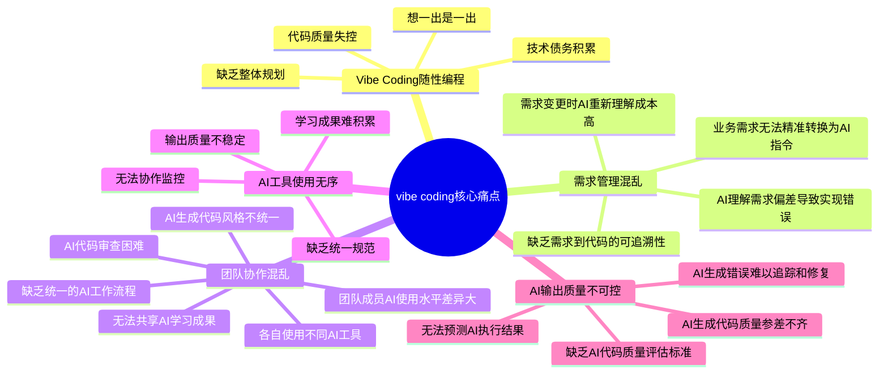
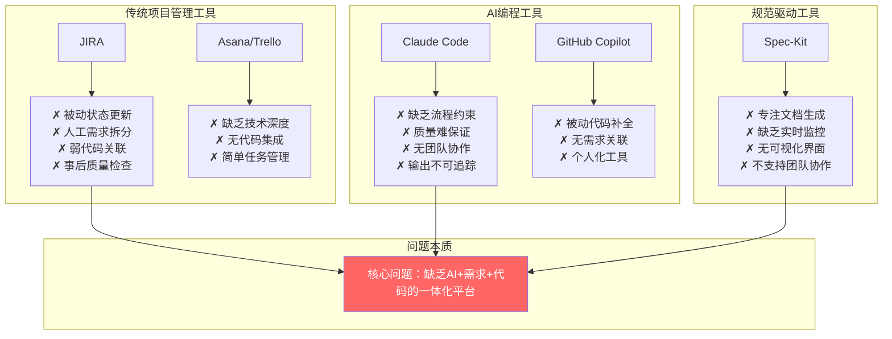
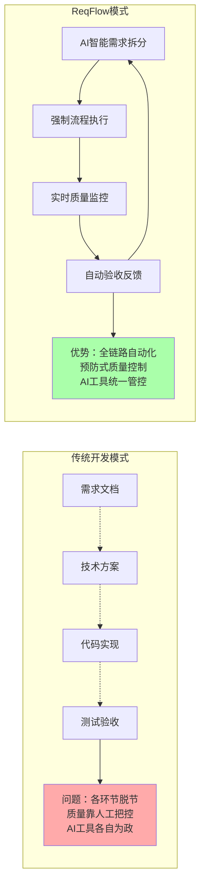

# 01-需求明确

## 1、项目名称

ReqFlow - AI驱动的规范化开发管理平台

## 2、产品定位

### 2.1 产品概述
ReqFlow是一个**类似JIRA的项目管理软件**，集成AI大模型能力，专门解决"vibe coding"过程不规范的问题。基于规范驱动开发思想，通过AI智能拆分需求、强制规范开发流程、实时质量监控，确保从需求到代码的全链路规范化，最大程度减少开发错误和质量问题。

> **核心理念**：需求即代码，文档即软件，业务即实现

### 2.2 痛点分析图



### 2.3 现有方案局限性对比



### 2.4 ReqFlow创新解决方案



### 2.5 核心价值
- **解耦合设计**: 通过Epic/Story/Task三层解耦，避免AI编程混乱
- **技术栈分离**: 数据库/后端/前端可独立并行开发  
- **接口契约约束**: 双层接口定义，强制模块间规范交互
- **AI智能拆分**: 将模糊需求拆解为可执行的结构化任务
- **并行开发支持**: 不同Epic、不同Task可自由安排开发顺序

## 3、核心功能模块

### 功能1：创建项目

**步骤1：项目基本信息**
- 项目名称 (必填)
- AI取名建议功能
- 项目简介 (必填) - 用户描述项目需求
- 项目团队成员 (可选) - 邀请团队成员加入

**步骤2：项目初始化**
- 确认项目信息
- 创建项目后进入需求澄清阶段


### 功能2：业务需求澄清

在用户创建完需求以后进行，基于项目简介，AI不断的提出问题，引导用户进行需求澄清，并输出自己对需求的理解。

由用户最后确认的需求，需要被存储到该项目的需求概述字段。


### 功能3：技术选型

业务需求澄清后进行，基于项目需求设计，用ai直接帮助用户进行技术选型。

为了方便用户快速开发，默认给出的初始设计遵循下面原则：

- 前后端分离，使用Swagger UI作为接口文档
- 数据库：推荐用户使用云数据库Supabase

用户可以实时和ai交互，并决定是否通过技术选型方案


### 功能4：需求拆分

基于spec driven的思想，根据业务需求，引导用户进行需求拆分，每个拆分出来的需求，对应一个系统的ticket(类似于jira)。

#### 4.1 三级拆分架构

**Epic（史诗级）**：
- **层级**：最高层，业务服务边界层面
- **内容**：完整的业务能力或产品功能模块
- **例子**："用户认证系统"、"订单管理系统"
- **特点**：跨越多个Sprint，定义服务边界和依赖关系
- **必须包含**：服务契约定义、对外接口声明、依赖关系映射

**Story（用户故事）**：
- **层级**：中间层，具体功能实现层面
- **内容**：从用户角度描述的具体功能需求
- **例子**："作为用户，我希望能够通过邮箱和密码登录"
- **特点**：一个Sprint内可完成，包含明确的验收标准
- **必须包含**：具体API接口定义、请求响应格式、业务逻辑规则

**Task（任务）**：
- **层级**：最底层，技术实现层面
- **内容**：具体的开发工作项，按技术栈强制分层
- **分层规则**：每个Story必须拆分为三层Task
  - 🗄️ **数据库层Task**：表设计、索引优化、数据迁移
  - ⚙️ **后端API层Task**：接口实现、业务逻辑、单元测试
  - 🎨 **前端UI层Task**：组件开发、状态管理、用户交互
- **粒度控制**：每个Task预估工作量0.5-4小时，超过4小时必须继续拆分

#### 4.2 双层接口契约机制

**Epic层服务契约**：
```yaml
service_name: user-auth-service
service_boundary: "用户认证、权限管理、会话控制"
dependencies: []  # 依赖的其他Epic服务
capabilities:
  - endpoint_prefix: "/api/auth/*"
    description: "认证相关接口"
  - endpoint_prefix: "/api/users/*" 
    description: "用户管理接口"
domain_models:
  - User: [id, email, role, status]
  - Session: [token, user_id, expires_at]
integration_contracts:
  - "其他服务获取用户信息必须调用 GET /api/users/{id}"
  - "权限验证必须调用 POST /api/auth/verify"
  - "禁止直接访问users、sessions数据表"
```

**Story层接口规格**：
```yaml
story_id: "AUTH-001"
story_title: "用户邮箱密码登录"
api_specification:
  endpoint: "POST /api/auth/login"
  request_schema:
    email: {type: string, format: email, required: true}
    password: {type: string, minLength: 8, required: true}
    remember_me: {type: boolean, default: false}
  response_schema:
    success_200:
      access_token: string
      refresh_token: string
      user: {id: string, email: string, role: string}
    error_401:
      message: "邮箱或密码错误"
  business_rules:
    - "密码错误5次锁定账户30分钟"
    - "remember_me=true时refresh_token有效期30天"
    - "登录成功更新last_login_at字段"
```

#### 4.3 AI智能拆分流程

**步骤1：Epic层拆分**
- AI基于业务需求识别独立的业务领域
- 自动生成服务边界和依赖关系图
- 为每个Epic生成服务契约模板
- 用户确认：通过/拒绝/修改建议

**步骤2：Story层拆分**
- AI基于每个Epic拆分具体的用户功能
- 自动生成API接口规格和数据模型
- 确保Story间接口契约一致性
- 用户确认：通过/拒绝/修改建议

**步骤3：Task层强制分层**
- AI自动将每个Story拆分为数据库、后端、前端三层Task
- 每层Task包含详细技术实现要求
- 自动生成Mock数据契约供前端开发使用
- 用户确认：通过/拒绝/修改建议

#### 4.4 并行开发约束机制

**接口契约先行**：
- Epic间依赖关系确定后，各Epic可并行开发
- Story的API接口确定后，三层Task可并行开发
- 前端Task基于API契约使用标准化Mock数据

**Mock数据标准**：
```javascript
// 自动生成的Mock数据契约
const mockContracts = {
  "POST /api/auth/login": {
    success_response: {
      access_token: "mock_jwt_token_xxxxx",
      refresh_token: "mock_refresh_token_xxxxx", 
      user: {id: "uuid-1234", email: "test@example.com", role: "user"}
    },
    error_responses: {
      401: {message: "邮箱或密码错误"},
      429: {message: "请求过于频繁，请稍后再试"}
    }
  }
}
```

**集成验证机制**：
- 数据库层Task完成后：表结构和接口契约一致性验证
- 后端API层Task完成后：接口实现和规格一致性验证
- 前端UI层Task完成后：Mock数据替换为真实API验证
- 所有Task完成后：端到端集成测试验证

**拆分质量控制**：
- 每个Epic必须包含完整的服务契约
- 每个Story必须包含具体的API规格
- 每个Task必须包含详细的验收标准
- AI拒绝生成不符合规范的拆分结果
- 用户修改建议必须符合接口契约约束

需求拆分详细案例见《05-需求拆分案例.md》

AI智能拆分的提示词工程策略见《06-AI提示词工程策略.md》

### 功能5：需求导出

可以将需求导出为md文件，给ai编程工具进行执行。需求导出策略见《03-导出功能设计.md》


